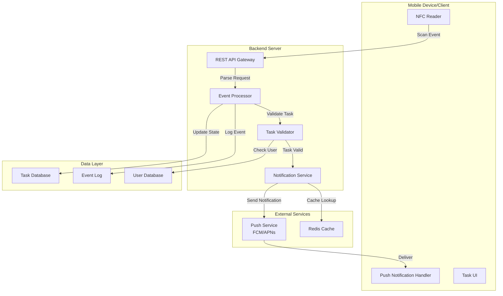
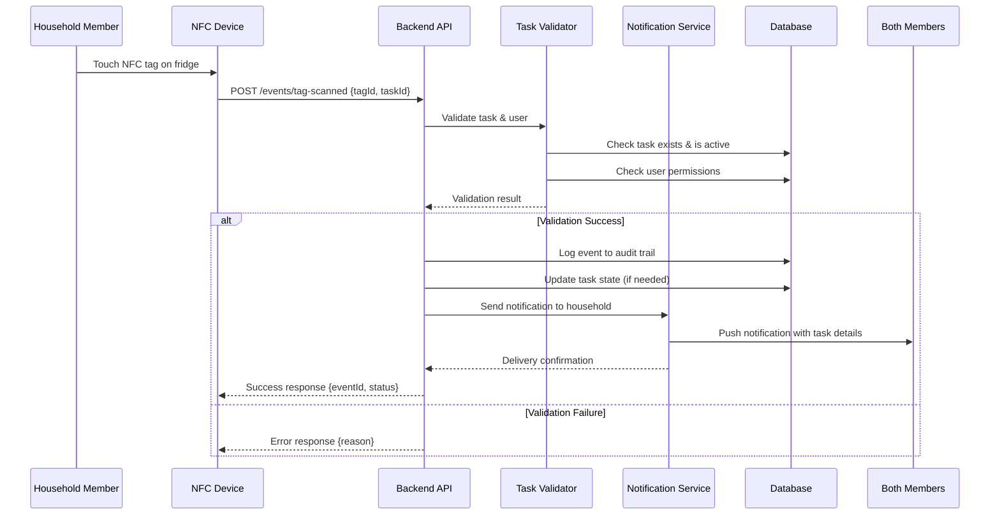

# Design Document: NFC Tag Notifications System

## Overview

The NFC Tag Notifications System enables household members to track and communicate household tasks through simple NFC tag interactions. When a household member touches an NFC tag (e.g., on the fridge), the system automatically sends push notifications to both parties, creating an efficient communication channel for task status updates. The system supports multiple expandable household tasks with persistent tracking and role-based access.

## Architecture

The system consists of five primary layers: NFC Interface Layer, Event Processing Layer, Notification Service, Data Persistence Layer, and User Management. These layers communicate through well-defined interfaces to enable decoupled, testable components.



## Components and Interfaces

### Component 1: NFC Reader Interface

**Purpose**: Manages NFC tag detection and data extraction from physical tags

**Interface**:
```typescript
interface NFCTagData {
  tagId: string
  taskId: string
  timestamp: number
  signature?: string // Optional security signature
}

interface NFCReaderInterface {
  startListening(): Promise<void>
  stopListening(): Promise<void>
  onTagDetected(callback: (data: NFCTagData) => void): void
  validateTagSignature(data: NFCTagData): boolean
}
```

**Responsibilities**:
- Scan and detect NFC tags in proximity
- Extract task ID and metadata from tag data
- Validate tag authenticity through signatures
- Handle multiple simultaneous tag reads
- Emit tag detection events to the event processor

### Component 2: Event Processor

**Purpose**: Coordinates the processing pipeline for tag detection events

**Interface**:
```typescript
interface TaskEvent {
  eventId: string
  userId: string
  taskId: string
  action: "execute" | "acknowledge" | "undo"
  timestamp: number
  metadata?: Record<string, unknown>
}

interface EventProcessor {
  processTagEvent(nfcData: NFCTagData): Promise<TaskEvent>
  enrichEventWithUserContext(event: TaskEvent): Promise<TaskEvent>
  validateEventIntegrity(event: TaskEvent): Promise<boolean>
}
```

**Responsibilities**:
- Convert NFC scan events to structured task events
- Enrich events with user and task context
- Validate event integrity and permissions
- Route events to appropriate handlers
- Log all events for audit trail

### Component 3: Task Validator

**Purpose**: Validates tasks, user permissions, and business rules

**Interface**:
```typescript
interface Task {
  taskId: string
  name: string
  description: string
  category: string
  createdAt: number
  createdBy: string
  isActive: boolean
  metadata?: Record<string, unknown>
}

interface HouseholdUser {
  userId: string
  householdId: string
  name: string
  role: "owner" | "member"
  pushToken: string
  permissions: string[]
}

interface TaskValidationResult {
  isValid: boolean
  errors: string[]
  task?: Task
  allowedUsers: HouseholdUser[]
}

interface TaskValidator {
  validateTaskExists(taskId: string): Promise<Task | null>
  validateUserPermission(userId: string, taskId: string): Promise<boolean>
  validateTaskCanExecute(taskId: string, userId: string): Promise<TaskValidationResult>
  listAvailableTasks(householdId: string): Promise<Task[]>
}
```

**Responsibilities**:
- Verify task exists and is active
- Check user permissions for task execution
- Validate household membership
- Enforce business rules (e.g., task-specific constraints)
- Return detailed validation results

### Component 4: Notification Service

**Purpose**: Handles delivery of push notifications to both household members

**Interface**:
```typescript
interface NotificationPayload {
  title: string
  body: string
  data: {
    taskId: string
    eventId: string
    eventType: string
    timestamp: number
  }
  deepLink?: string
}

interface NotificationRecipient {
  userId: string
  pushToken: string
  preferences: {
    notificationsEnabled: boolean
    mutedTasks: string[]
    quietHours?: { start: number; end: number }
  }
}

interface NotificationService {
  sendNotification(
    payload: NotificationPayload,
    recipients: NotificationRecipient[]
  ): Promise<{ delivered: string[]; failed: string[] }>
  
  sendToHouseholdMembers(
    taskId: string,
    event: TaskEvent,
    excludeUser?: string
  ): Promise<void>
}
```

**Responsibilities**:
- Format notifications with task details
- Respect user notification preferences
- Retry failed deliveries with exponential backoff
- Track delivery status and outcomes
- Integrate with FCM (Android) and APNs (iOS)

### Component 5: Data Persistence Layer

**Purpose**: Manages all data storage and retrieval operations

**Interface**:
```typescript
interface TaskRepository {
  findTaskById(taskId: string): Promise<Task | null>
  findTasksByHousehold(householdId: string): Promise<Task[]>
  createTask(task: Omit<Task, "taskId" | "createdAt">): Promise<Task>
  updateTask(taskId: string, updates: Partial<Task>): Promise<Task>
  deactivateTask(taskId: string): Promise<void>
}

interface EventRepository {
  logEvent(event: TaskEvent): Promise<void>
  getEventHistory(taskId: string, limit?: number): Promise<TaskEvent[]>
  getEventsByUser(userId: string, limit?: number): Promise<TaskEvent[]>
  queryEventsByDateRange(
    startTime: number,
    endTime: number
  ): Promise<TaskEvent[]>
}

interface UserRepository {
  findUserById(userId: string): Promise<HouseholdUser | null>
  findUsersInHousehold(householdId: string): Promise<HouseholdUser[]>
  updateUserPushToken(userId: string, newToken: string): Promise<void>
  updateUserPreferences(userId: string, preferences: Partial<HouseholdUser>): Promise<void>
}
```

**Responsibilities**:
- Store and retrieve tasks with query capabilities
- Maintain event audit logs
- Store user profiles and push tokens
- Ensure data consistency and integrity
- Provide efficient queries for common operations

### Component 6: User Management & Household Setup

**Purpose**: Manages household creation, user roles, and access control

**Interface**:
```typescript
interface Household {
  householdId: string
  name: string
  createdAt: number
  createdBy: string
  members: string[] // userId array
  settings: {
    defaultNotificationSettings: object
    taskCategories: string[]
  }
}

interface HouseholdManager {
  createHousehold(name: string, creatorId: string): Promise<Household>
  addUserToHousehold(householdId: string, userId: string): Promise<void>
  removeUserFromHousehold(householdId: string, userId: string): Promise<void>
  getHouseholdInfo(householdId: string): Promise<Household>
  updateUserRole(householdId: string, userId: string, role: "owner" | "member"): Promise<void>
}
```

**Responsibilities**:
- Create and manage households
- Add/remove members with role assignment
- Track household settings and preferences
- Enforce access control across all operations

## Data Models

### Model 1: Task

```typescript
interface Task {
  // Unique identifier for the task
  taskId: string
  
  // Human-readable task name (e.g., "Fed Lenny Dinner")
  name: string
  
  // Detailed description of the task
  description: string
  
  // Category for organization (e.g., "Pet Care", "Household Chores")
  category: string
  
  // Household this task belongs to
  householdId: string
  
  // Creation timestamp (Unix milliseconds)
  createdAt: number
  
  // User who created this task
  createdBy: string
  
  // Whether this task is currently active/available
  isActive: boolean
  
  // Optional task-specific metadata
  metadata?: {
    // For recurring tasks
    recurrence?: "daily" | "weekly" | "monthly" | "one-time"
    
    // When task should be completed by (if applicable)
    dueDate?: number
    
    // Estimated duration in minutes
    estimatedMinutes?: number
    
    // Custom task-specific fields
    [key: string]: unknown
  }
}
```

**Validation Rules**:
- `taskId` must be unique within the household
- `name` must be 1-100 characters
- `category` must exist in household settings
- `createdBy` must be a valid household member
- `isActive` must be boolean

### Model 2: TaskEvent

```typescript
interface TaskEvent {
  // Unique identifier for this event
  eventId: string
  
  // User who triggered the event
  userId: string
  
  // Task being acted upon
  taskId: string
  
  // Household context
  householdId: string
  
  // Type of action performed
  action: "execute" | "acknowledge" | "undo" | "comment"
  
  // When event occurred (Unix milliseconds)
  timestamp: number
  
  // Optional metadata specific to action
  metadata?: {
    // For acknowledgments
    acknowledged?: boolean
    
    // For comments/notes
    notes?: string
    
    // Device info
    deviceType?: "mobile" | "web" | "nfc-reader"
    
    // Custom event metadata
    [key: string]: unknown
  }
}
```

**Validation Rules**:
- `eventId` must be globally unique
- `userId` must belong to `householdId`
- `taskId` must belong to `householdId`
- `action` must be one of allowed values
- `timestamp` must be recent (within last 24 hours)

### Model 3: HouseholdUser

```typescript
interface HouseholdUser {
  // Unique user identifier
  userId: string
  
  // Household membership
  householdId: string
  
  // Display name
  name: string
  
  // User role in household
  role: "owner" | "member"
  
  // Firebase/platform push token
  pushToken: string
  
  // Permissions this user has
  permissions: string[] // e.g., ["task.execute", "task.create", "task.delete"]
  
  // User preferences
  preferences: {
    // Whether to receive push notifications
    notificationsEnabled: boolean
    
    // Task IDs to mute notifications for
    mutedTasks: string[]
    
    // Quiet hours (24-hour format)
    quietHours?: {
      start: number // 0-23
      end: number   // 0-23
    }
    
    // Notification channels
    channels: ("push" | "email" | "sms")[]
  }
  
  // Account timestamps
  createdAt: number
  lastActiveAt?: number
}
```

**Validation Rules**:
- `userId` must be unique globally
- `householdId` must exist
- `role` must be "owner" or "member"
- `pushToken` must be valid for the platform
- `permissions` must be from allowed set

## Main Algorithm/Workflow



## Key Functions with Formal Specifications

### Function 1: procesTagEvent()

```typescript
async function processTagEvent(nfcData: NFCTagData): Promise<TaskEvent> {
  // Input: NFCTagData containing tagId, taskId, timestamp
  // Output: TaskEvent with event ID, user context, and status
  
  // Preconditions:
  // - nfcData.tagId must be non-empty string
  // - nfcData.taskId must be non-empty string
  // - nfcData.timestamp must be recent (within last 5 minutes)
  
  // Postconditions:
  // - Returns TaskEvent with unique eventId
  // - TaskEvent.timestamp matches or is close to nfcData.timestamp
  // - Event is persisted to audit log
  // - User context is enriched with household/permissions info
}
```

**Formal Specification**:

```typescript
interface Preconditions {
  // NFC data must be valid and properly structured
  isValidNFCData(data: NFCTagData): boolean {
    return data.tagId && data.taskId && 
           Date.now() - data.timestamp < 5 * 60 * 1000 // 5 minutes
  }
}

interface Postconditions {
  // Event must be uniquely identified
  isUniqueEventId(event: TaskEvent): boolean {
    return event.eventId !== null && event.eventId.length > 0
  }
  
  // Event must be persisted
  isPersistedToDB(event: TaskEvent): boolean {
    return eventRepository.findById(event.eventId) !== null
  }
  
  // User context must be enriched
  hasUserContext(event: TaskEvent): boolean {
    return event.userId !== null && event.householdId !== null
  }
}
```

### Function 2: validateAndNotify()

```typescript
async function validateAndNotify(
  event: TaskEvent,
  validator: TaskValidator,
  notifier: NotificationService
): Promise<{ isValid: boolean; notification?: NotificationResult }> {
  // Input: TaskEvent, validator instance, notifier instance
  // Output: Validation result and notification delivery status
  
  // Preconditions:
  // - event must have valid userId, taskId, householdId
  // - validator must be initialized and connected to database
  // - notifier must have valid push service credentials
  
  // Postconditions:
  // - If validation passes:
  //   - Notifications sent to all household members (except executor)
  //   - Each recipient's preferences respected
  //   - Delivery attempts logged
  // - If validation fails:
  //   - No notifications sent
  //   - Error details returned
  
  // Loop Invariants (for notification to multiple recipients):
  // - All previously checked recipients remain in the household
  // - Notification preferences checked for each recipient
  // - Failures don't prevent other recipients from being notified
}
```

### Function 3: sendToHouseholdMembers()

```typescript
async function sendToHouseholdMembers(
  taskId: string,
  event: TaskEvent,
  excludeUser?: string
): Promise<void> {
  // Input: taskId, TaskEvent, optional userId to exclude
  // Output: Notifications sent to all eligible household members
  
  // Preconditions:
  // - taskId must exist and be active
  // - event must be valid TaskEvent
  // - excludeUser (if provided) must be valid userId
  
  // Postconditions:
  // - Notifications sent to all members except executor
  // - Each notification respects user preferences (quiet hours, muted tasks)
  // - Failed deliveries are retried with exponential backoff
  // - Delivery log updated for audit trail
  
  // Loop Invariants:
  // - All previous recipients' notifications were attempted
  // - Quiet hours check consistent for all recipients
  // - Muted task list consistent throughout iteration
}
```

## Algorithmic Pseudocode

### Main Event Processing Algorithm

```typescript
ALGORITHM processNFCTagEvent(nfcData: NFCTagData, userId: string)
  INPUT: nfcData of type NFCTagData, userId of type string
  OUTPUT: result of type EventProcessingResult
  
  BEGIN
    // Step 1: Validate NFC data integrity
    ASSERT isValidNFCData(nfcData) = true
    ASSERT userId IS NOT null AND userId IS NOT empty
    
    // Step 2: Create event structure
    event ← createTaskEvent(nfcData, userId)
    
    // Step 3: Retrieve household context
    household ← databaseQuery("households", event.householdId)
    ASSERT household IS NOT null
    
    // Step 4: Validate task exists and is active
    task ← databaseQuery("tasks", event.taskId)
    ASSERT task IS NOT null AND task.isActive = true
    ASSERT task.householdId = event.householdId
    
    // Step 5: Check user permissions
    user ← databaseQuery("users", userId)
    ASSERT user IS NOT null
    hasPermission ← checkUserPermission(user, "task.execute", task.category)
    ASSERT hasPermission = true
    
    // Step 6: Log event to audit trail
    databaseInsert("taskEvents", event)
    
    // Step 7: Send notifications to household members
    householdMembers ← databaseQuery("users", "householdId", event.householdId)
    FOR each member IN householdMembers DO
      ASSERT member.pushToken IS NOT null
      
      // Skip notification to task executor (already know about it)
      IF member.userId ≠ userId THEN
        notification ← createNotification(task, event, member)
        
        // Check notification preferences
        IF member.preferences.notificationsEnabled = true THEN
          IF taskNotMuted(member, task.taskId) THEN
            IF notInQuietHours(member) THEN
              sendPushNotification(notification, member.pushToken)
            END IF
          END IF
        END IF
      END IF
    END FOR
    
    // Step 8: Return success status
    RETURN { success: true, eventId: event.eventId }
  END
END ALGORITHM
```

**Preconditions**:
- nfcData must be valid and recent
- userId must belong to the household
- Task must be active and valid
- User must have execute permissions

**Postconditions**:
- Event is persisted to database
- All household members receive appropriate notifications
- Audit trail includes complete event details

**Loop Invariants** (for household member notification loop):
- All previously processed members had their notification preferences checked
- Members not yet processed remain in the household
- Task remains active throughout iteration
- Notification list maintains consistency

### Validation and Authorization Algorithm

```typescript
ALGORITHM validateTaskExecution(userId: string, taskId: string, householdId: string)
  INPUT: userId, taskId, householdId (all strings)
  OUTPUT: validation of type ValidationResult
  
  BEGIN
    // Step 1: Initialize validation state
    validation ← { isValid: false, errors: [] }
    
    // Step 2: Check user exists and belongs to household
    user ← databaseQuery("users", userId)
    IF user IS null THEN
      validation.errors.append("User not found")
      RETURN validation
    END IF
    
    IF user.householdId ≠ householdId THEN
      validation.errors.append("User does not belong to household")
      RETURN validation
    END IF
    
    // Step 3: Check task exists and is in same household
    task ← databaseQuery("tasks", taskId)
    IF task IS null THEN
      validation.errors.append("Task not found")
      RETURN validation
    END IF
    
    IF task.householdId ≠ householdId THEN
      validation.errors.append("Task not in household")
      RETURN validation
    END IF
    
    // Step 4: Check task is active
    IF task.isActive ≠ true THEN
      validation.errors.append("Task is not active")
      RETURN validation
    END IF
    
    // Step 5: Check user has execute permission
    hasPermission ← false
    FOR each permission IN user.permissions DO
      IF permission = "task.execute" OR permission = "admin" THEN
        hasPermission ← true
        EXIT FOR
      END IF
    END FOR
    
    IF hasPermission ≠ true THEN
      validation.errors.append("User lacks execute permission")
      RETURN validation
    END IF
    
    // Step 6: All checks passed
    validation.isValid ← true
    RETURN validation
  END
END ALGORITHM
```

**Preconditions**:
- All input parameters are non-null strings
- Database connection is active

**Postconditions**:
- Returns detailed validation result
- If validation fails, errors list contains all failure reasons
- If validation passes, isValid flag is true

**Loop Invariants** (permission checking):
- All previously checked permissions were evaluated correctly
- User object remains consistent throughout checks

## Example Usage

```typescript
// Example 1: User touches NFC tag on fridge
const nfcData: NFCTagData = {
  tagId: "nfc_fridge_001",
  taskId: "task_lenny_dinner",
  timestamp: Date.now(),
  signature: "sig_verified"
}

const userId = "user_alice_123"
const result = await processTagEvent(nfcData, userId)
// Result: { success: true, eventId: "evt_20240115_001" }
// Both Alice and her partner receive: "Alice fed Lenny dinner"

// Example 2: Creating a new task in the system
const newTask: Task = {
  taskId: "task_balcony_clean",
  name: "Clean the Balcony",
  description: "Sweep and tidy up the balcony area",
  category: "Household Chores",
  householdId: "hh_alice_bob",
  createdAt: Date.now(),
  createdBy: "user_alice_123",
  isActive: true,
  metadata: {
    recurrence: "weekly",
    estimatedMinutes: 30
  }
}

const createdTask = await taskRepository.createTask(newTask)

// Example 3: Sending notifications with preferences respected
const event: TaskEvent = {
  eventId: "evt_20240115_002",
  userId: "user_alice_123",
  taskId: "task_lenny_dinner",
  householdId: "hh_alice_bob",
  action: "execute",
  timestamp: Date.now(),
  metadata: {
    deviceType: "nfc-reader"
  }
}

await notificationService.sendToHouseholdMembers(
  "task_lenny_dinner",
  event,
  "user_alice_123" // Exclude the executor
)
// Notification sent only to Bob if:
// - His notifications are enabled
// - Task is not muted
// - It's outside quiet hours
```

## Correctness Properties

*A property is a characteristic or behavior that should hold true across all valid executions of a system—essentially, a formal statement about what the system should do. Properties serve as the bridge between human-readable specifications and machine-verifiable correctness guarantees.*

### Property 1: Tag Event Processing Idempotence

*For any* valid NFC tag data scanned by a user, processing the same tag data multiple times within a short window should result in only one task event being created and persisted, preventing duplicate notifications.

### Property 2: Notification Delivery Consistency

*For any* task event created from a valid NFC tag scan, all non-executing household members should receive a notification within the expected delivery window, respecting their individual notification preferences.

### Property 3: User Authorization Enforcement

*For any* task execution request, a user without proper permissions should never be able to trigger a task, and their attempt should be rejected with appropriate error handling.

### Property 4: Household Isolation

*For any* task or event in a household, users from different households should never be able to access, modify, or receive notifications about tasks not belonging to their household.

### Property 5: Event Audit Trail Completeness

*For any* task event, all relevant details (user, task, timestamp, action type, household context) should be persisted to the audit log exactly once and remain immutable for historical tracking.

### Property 6: Push Token Rotation Safety

*For any* user whose push token is updated, the system should cleanly transition from old to new token, ensuring no notifications are lost during the transition and stale tokens are retired.

## Error Handling

### Error Scenario 1: Invalid or Expired NFC Tag

**Condition**: User scans an NFC tag that doesn't exist, has been revoked, or contains corrupted data

**Response**: System logs the failed scan, returns HTTP 400 with descriptive error message ("Tag not found or invalid")

**Recovery**: User receives UI feedback to try again or contact support. Admin can review failed scans in logs.

### Error Scenario 2: User Not Authorized

**Condition**: User attempts to execute a task they don't have permission for

**Response**: System rejects the event with HTTP 403 Forbidden, no notification sent

**Recovery**: User is notified via error message. Household owner can grant permission via app settings.

### Error Scenario 3: Push Notification Delivery Failure

**Condition**: Firebase Cloud Messaging or APNs rejects notification delivery

**Response**: System logs failure, retries with exponential backoff (max 3 attempts over 5 minutes)

**Recovery**: Notifications may be delivered after retry; if all retries fail, event is still logged for async replay

### Error Scenario 4: Database Connection Loss

**Condition**: Backend loses connection to database during event processing

**Response**: System returns 503 Service Unavailable, queues the event in-memory

**Recovery**: Event is retried once database connection is restored; automatic reconnection with backoff

### Error Scenario 5: Task Deactivated During Processing

**Condition**: Task is deactivated by another household member while a scan is being processed

**Response**: Validation fails with "Task is no longer active" error

**Recovery**: No notification sent. User can be informed that task was deactivated.

## Testing Strategy

### Unit Testing Approach

- Test each component in isolation with mocks for dependencies
- Validate preconditions and postconditions for algorithms
- Test permission checks with various user roles
- Test task validation with edge cases (missing fields, wrong household, etc.)
- Test notification preference logic (quiet hours, muted tasks)
- Target: 80%+ line coverage for core business logic

### Property-Based Testing Approach

Property-based testing validates universal correctness properties across a wide range of generated inputs.

**Property Test Library**: fast-check (for TypeScript)

**Key Properties to Test**:
1. **Idempotence Property**: Multiple identical tag scans within short window produce only one event
2. **Authorization Property**: Any unauthorized user request is rejected consistently
3. **Isolation Property**: Tasks in one household never leak to other households
4. **Consistency Property**: Event in database always matches audit log entry

**Test Configuration**: Minimum 100 iterations per property, with generated:
- Valid and invalid user IDs
- Valid and invalid task IDs
- Various household configurations
- Edge case timestamps and data

### Integration Testing Approach

- Test full event flow from NFC scan to notification delivery
- Test with real push service (or mocked FCM/APNs)
- Verify database transactions and consistency
- Test recovery scenarios (network failures, retries)
- Test multi-user concurrent scenarios

## Performance Considerations

- **Event Processing Latency**: Target < 500ms from NFC scan to notification send
- **Database Query Optimization**: Index on (householdId, taskId, userId) for fast lookups
- **Caching Strategy**: Cache household member list and permissions in Redis with 5-minute TTL
- **Notification Delivery**: Batch notifications when multiple events occur in quick succession
- **Audit Log Retention**: Store events for 1 year, archive older events to cold storage

## Security Considerations

- **NFC Tag Verification**: Implement HMAC signatures on NFC tags to prevent spoofing
- **User Authentication**: Require multi-factor authentication for household setup
- **Data Encryption**: Encrypt sensitive data at rest (push tokens, user details) and in transit (HTTPS)
- **Rate Limiting**: Limit NFC tag scans to 1 per task per user per 30 seconds
- **Permission Model**: Implement principle of least privilege; default to deny unless explicitly allowed
- **Audit Logging**: Log all permission checks and authorization failures for security review

## Dependencies

- **Mobile SDKs**: react-native-nfc-manager (React Native), Core NFC (iOS), Android NFC Framework
- **Push Services**: Firebase Cloud Messaging (FCM), Apple Push Notification (APNs)
- **Database**: PostgreSQL or MongoDB for event/task storage
- **Caching**: Redis for session and permission caching
- **Authentication**: Firebase Auth or custom JWT-based authentication
- **Testing**: fast-check for property-based tests, Jest for unit tests
- **Backend Framework**: Express.js or NestJS (TypeScript)
- **ORM/Query Builder**: TypeORM or Prisma for database access
